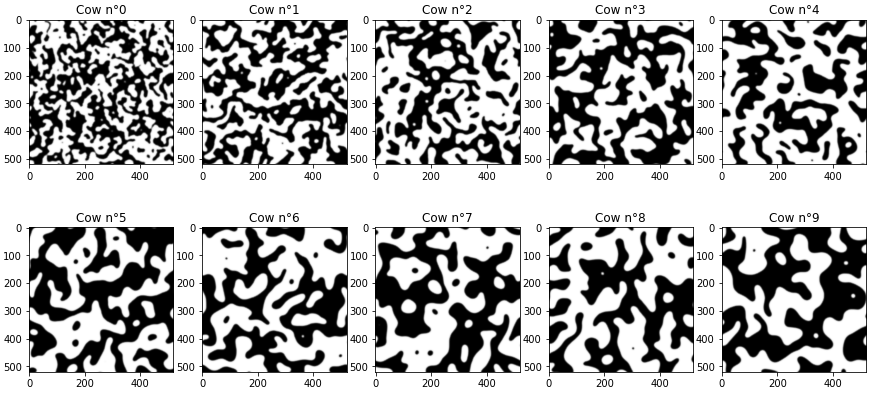

# cow-tex-generator

Ever felt the need to have an infinite supply of cow pattern textures ?

This project was inspired by [_The leopard never changes its spots_](https://mgmalheiros.github.io/research/leopard/), a SIGGRAPH 2020 paper by Malheiros, Marcelo de G. and Fensterseifer, Henrique and Walter, Marcelo. This paper uses a reaction-diffusion model to approximate tissue growth, and successfully generates a few 2D patterns matching real species. This repository aims to adapt this model to generate cow patterns, which were not covered in the original article.

## Generate textures

In `\python`, we provide a python notebook that generates such textures with varying input parameters. To generate your own textures, open this notebook and run all the cells.

 

## Cow fine-tuning and visualization

Let's use libigl to see what our texture looks like on a _real_ cow. To build and run, use:

```
git submodule update --init
mkdir build
cd build
cmake ..
make cow 
./cow
```

<p align="center">

</p> 


